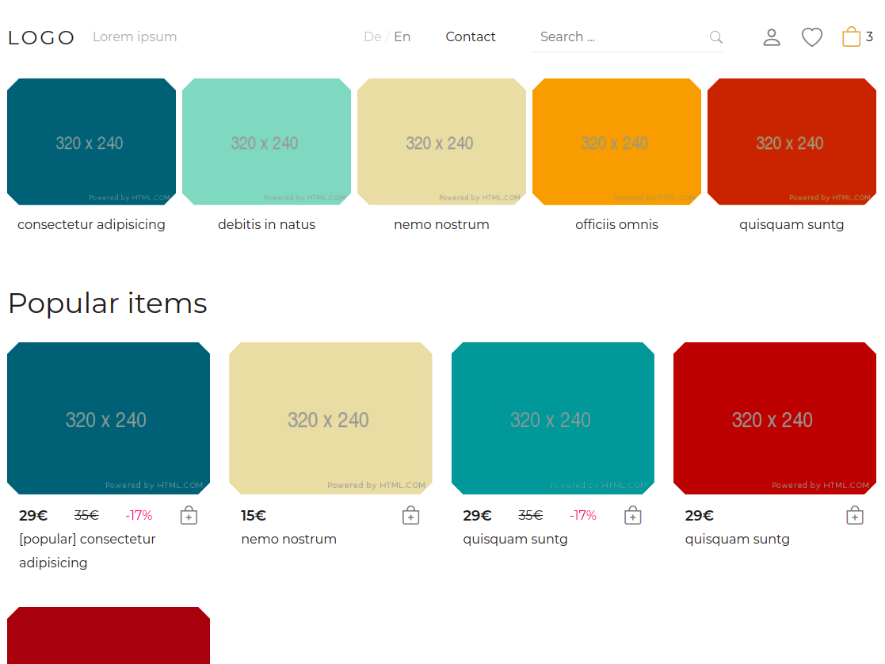
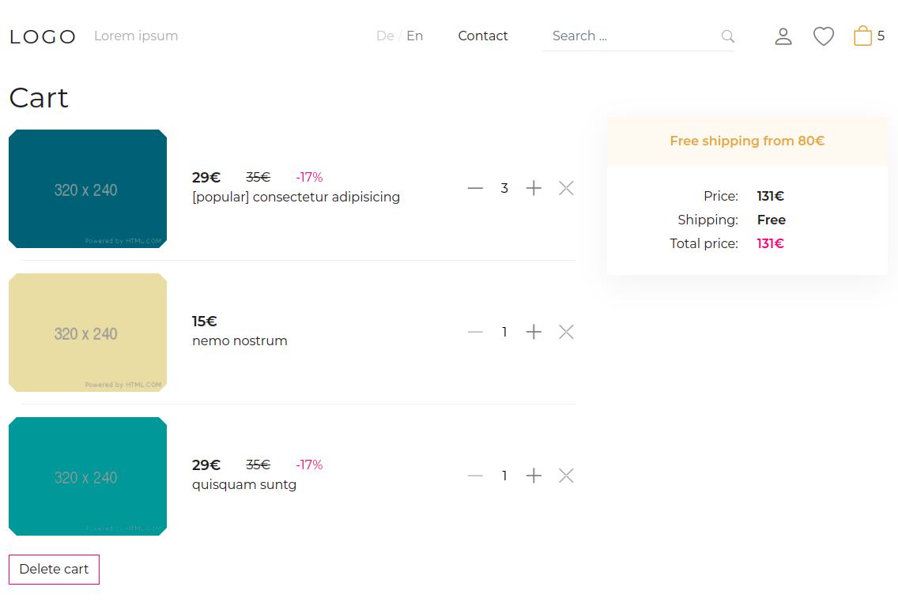

# Demo online shop (vue)
* vue
* vuex
* vite
* vue-router
* vue-i18n

### run project `npm run dev`

## ToDo

```
[x] Add item to cart
[x] Save cart in LS
[x] Save items in store (vuex)
[x] Delete item from Cart
[x] Delele all items from cart
[x] Get items by category
[x] Search (only items)
[ ] Item page
[ ] Toast component with info messages
[ ] Confirm modal window
[ ] Use data fro API
[ ] Checkout form with vuelidate 
[ ] Wish list
[ ] User page
...
```

